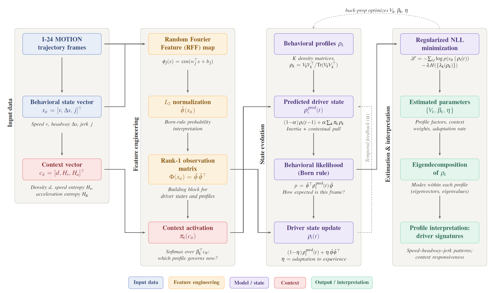

# Quantum-Inspired Modeling of Driving Behavior

Reproducible code and data for the paper

> **Quantum-Inspired Modeling of Driving Behavior** (Preprint)\
> Mohammad Elayan¹, Omid Armantalab¹, Wissam Kontar¹\
> ¹ Civil and Environmental Engineering, University of Nebraska–Lincoln\
> arXiv:2608.25907 (2026).\
> [https://arxiv.org/abs/2608.25907](https://arxiv.org/abs/2608.25907) ·

Drivers are modeled as density matrices over a random Fourier
feature space. A small number of behavioral profiles, each a density matrix, are
mixed according to the traffic context, and each driver's state evolves by
blending toward that mixture and then updating on what the driver actually did.

<p align="center">
  
  <br>
  <em>Estimation pipeline of the quantum-inspired driver behavioral profiling framework.</em>
</p>

## Model

Per driver, per frame `t`:

```
pi(c_t)   = softmax(beta c_t)                        context activation
rho_t     = (1 - alpha) rho_{t-1} + alpha sum_k pi_k rho_k    state evolution
p(x_t)    = phi_t^T rho_t phi_t                      Born-rule likelihood
rho_{t+1} = (1 - eta) rho_t + eta phi_t phi_t^T      behavioral adaptation
```

`phi_t` is the L2-normalized random Fourier feature map of the behavioral vector
`(speed, headway, jerk)`. `c_t` is the standardized context vector
`(density, sp_entropy, accel_entropy)`. Each profile is
`rho_k = V_k V_k^T / tr(V_k V_k^T)`, which is symmetric, PSD and unit-trace by
construction.

Objective:

```
L = -log p(x_t)  -  gamma * sum_k S(rho_k)
```

where `S(rho) = -tr(rho log rho)` is the von Neumann entropy.

### On gamma

`gamma` is the weight on the entropy penalty. It is subtracted, so raising it
spreads each profile's spectral mass across more eigenvectors. Without it every
`rho_k` collapses to rank one, and a profile can then only ever represent a
single behavioral mode. The point of the density-matrix formulation is that one
profile can hold several modes at once, so `gamma` is what makes the model do the
thing it exists to do.

`gamma` is a penalty weight. It is unrelated to the eigenvalues `lambda_i` of
`rho_k`, which are eigenvalues and nothing else. The two are never mixed in this
codebase.

### What is fitted and what is not

Fitted: `V_k` and `beta`.

Fixed: `alpha` and `eta`.

`alpha` is fixed because a learnable `alpha` collapses toward zero, which
switches off the context-driven mixture and leaves only the observation update.

`eta` is fixed because no gradient can reach it. It appears only in `rho_{t+1}`,
which is detached into the per-driver state before the next frame, so the loss
never depends on it. It is carried as a plain float rather than a parameter so
that the code says what it is. Its value still shapes the forward recursion.

## Layout

```
src/qdm/            constants and shared library code
  config.py         every constant. Change values here, not in the scripts.
  lanes.py          lane assignment from lateral position
  signals.py        differencing, windowed statistics, entropy
  spacetime.py      neighbor and leader lookup
  model.py          the model, shared by training and inference
  features.py       RFF map and scalers, fit once during training
  io.py             parquet loading, imputation, frame alignment

scripts/
  make_synthetic_data.py    fake data, to smoke-test the pipeline
  00_preprocess/            raw JSON -> the six modeled variables
  01_discovery/             rank 22 candidate variables, justify the six
  02_train/                 fit the profiles
  03_infer/                 run the model forward, save per-frame state
  04_analysis/              profile geometry and interpretation
  05_macroscopic/           time-space, fundamental diagram, hysteresis

data/                       not tracked. Created at runtime.
  raw/ processed/ models/ inference/ analysis/
```

Every script begins with an `Upstream:` and `Downstream:` block naming the exact
files it reads and the scripts that consume what it writes.

## Data

The I-24 MOTION dataset is **not in this repository**. It is released by
Vanderbilt under a data use agreement.

The paper uses one day of the INCEPTION release:

| Date | Start | Duration | Collection identifier |
| --- | --- | --- | --- |
| 22 Nov 2022 (Tue) | 06:00 | 4 h | `637c399add50d54aa5af0cf4__post2` |

Register at <https://i24motion.org>, download that file, and put it in
`data/raw/`. See [`data/raw/README.md`](data/raw/README.md) for the required
schema, the required citation, and why the file must be used as downloaded rather
than pre-filtered.

Preprocessing validates the file on load and fails immediately with a readable
message if it is the wrong format or the wrong direction.

## Install

```bash
python -m venv .venv && source .venv/bin/activate
pip install -r requirements.txt
```

## Run

Stage 0 is the expensive one. Everything after it runs on a laptop.

```bash
# 0. six variables from the raw trajectories. Chunks are independent.
python scripts/00_preprocess/preprocess.py \
    --json data/raw/<your_file>.json --chunk 0 --n-chunks 32
python scripts/00_preprocess/merge_chunks.py --n-chunks 32

# 1. optional: justify the variable selection
python scripts/01_discovery/variable_discovery.py --json data/raw/<your_file>.json

# 2. fit
python scripts/02_train/train_qdm.py

# 3. run forward, save per-frame profile mixtures
python scripts/03_infer/infer.py

# 4. interpret the profiles
python scripts/04_analysis/compute_frobenius.py
python scripts/04_analysis/compute_interactions.py
python scripts/04_analysis/profile_signatures.py

# 5. macroscopic
python scripts/05_macroscopic/build_xt_diagrams.py
python scripts/05_macroscopic/build_fd.py
python scripts/05_macroscopic/build_fd_with_pi.py
python scripts/05_macroscopic/hysteresis.py
```

Defaults reproduce the paper. Every constant in `src/qdm/config.py` is also a CLI
flag.

### Smoke test

The pipeline can be checked without the real dataset. `make_synthetic_data.py`
invents trajectories with the same schema:

```bash
python scripts/make_synthetic_data.py
python scripts/02_train/train_qdm.py --epochs 2 --n-egos 200 --cpu
python scripts/03_infer/infer.py --n-egos 100 --cpu
```

This runs in about a minute. **The data is invented, so every number it produces
is meaningless.** It verifies only that the stages connect and that each file the
next stage expects actually gets written. It is not a reproduction of anything.

### Preprocessing cost

Stage 0 holds every westbound vehicle's trajectory in memory to build the
spacetime index, and it does that in every chunk. Chunks are fully independent,
so on a cluster run them as a job array. On a single machine, run them
sequentially, or use `--limit-egos` to score a subset. The index is always built
from the full set of vehicles regardless.

## Reproducing

Seed is 702 throughout. `K=3`, `D=100`, `rank=10`, `alpha=0.2`, `eta=0.1`,
`gamma=4.0`. The RFF map is fit with `random_state=42` on the full dataset before
any subsampling, so the feature space does not depend on which egos are drawn.

Model selection uses the unregularized NLL, not the regularized objective. A
large `gamma` would otherwise select whichever epoch happened to maximize
profile entropy.

The RFF sampler and both scalers are pickled at training time and loaded by
everything downstream. Nothing is ever refit after training.

## Note

If you use the I-24 MOTION data, the data use agreement requires:

> Gloudemans, D., Wang, Y., Ji, J., Zachar, G., Barbour, W., Hall, E.,
> Cebelak, M., Smith, L., and Work, D.B. (2023). I-24 MOTION: An instrument for
> freeway traffic science. *Transportation Research Part C*, 155, 104311.

## Citation

```bibtex
@article{elayan2026quantum,
  title   = {Quantum-Inspired Modeling of Driving Behavior},
  author  = {Elayan, Mohammad and Armantalab, Omid and Kontar, Wissam},
  journal = {arXiv preprint arXiv:2608.25907},
  year    = {2026},
  doi     = {10.48550/arXiv.2608.25907}
}
```
